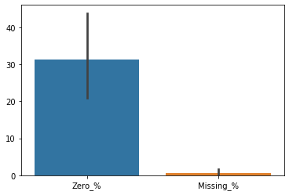
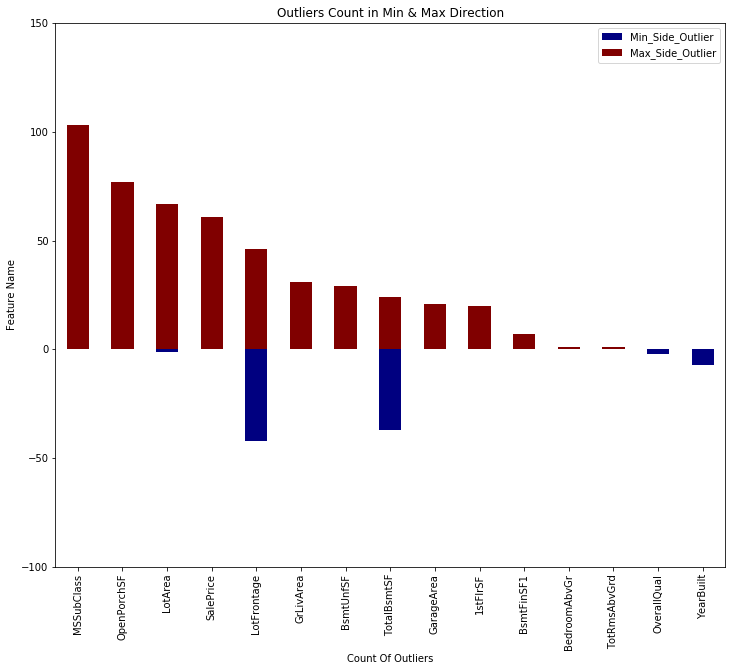
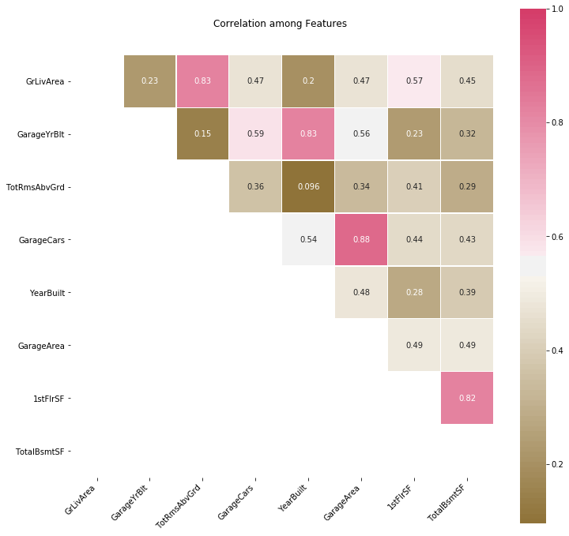
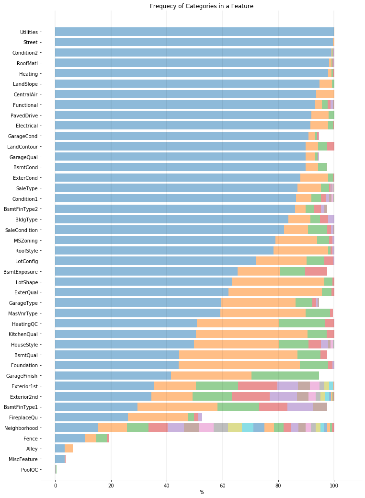
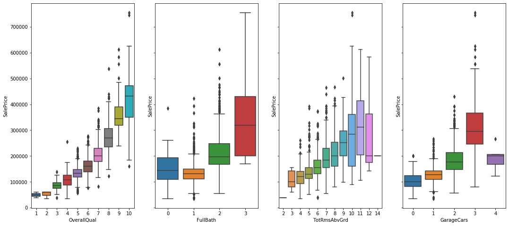

<font color='red'><b>Goals For Housing Dataset - EDA</font>
    <br>
<font color='blue'><b>1. Summary statistics Of Dataset- Non Graphical & Graphical</font>
        <br>
<font color='blue'><b>2. Ouliers Count in the Numericals Features</font>
        <br>
<font color='blue'><b>3. Multicolinearity</font>
        <br>
<font color='blue'><b>4. Frequency Distribution in the Categorical Features</font>
            <br>
<font color='blue'><b>5. Find out Features those having more imapct on target variable</font>

<font color='blue'>Import necessary Packages </font>


```python
import pandas as pd
import numpy as np
import matplotlib.pyplot as plt 
import re
from collections import defaultdict
from collections import Counter 
import seaborn as sns
import warnings
warnings.simplefilter("ignore")
```

<font color='blue'>Import the test and train Dataset </font>


```python
test = pd.read_csv('D:\HATHWAY ISP\DSC\Project\Housing\\test.csv')
train = pd.read_csv('D:\HATHWAY ISP\DSC\Project\Housing\\train.csv')
```

<font color='blue'>How many Observations and features in the Dataset?</font>


```python
train.shape
```


    (1460, 81)


<font color='blue'>Write Functions to calculate Summary For</font>
<font color='blue'>Missing Value, </font>
<font color='blue'>Missing %, </font>
<font color='blue'>Mean Value, </font>
<font color='blue'>Zero Values Count, </font>
<font color='blue'>Zero Values %, </font>


```python
def distinct_feature_values(train_s):
    return len(train_s.unique())
def missing_feature_values(train_s):
    return train_s.isnull().sum()
def feature_mean_value(train_s):
    return train_s.mean()
def feature_max_value(train_s):
    return train_s.max()
def feature_min_value(train_s):
    return train_s.min()
def feature_zero_value(train_s):
    return train_s[train_s == 0].count()
def feature_mode_value(train_s):
    CO = Counter(train_s)
    data, count = (CO.most_common(1)[0])
    return data
def feature_freq_dist(feature,train_s):
    return train_s.groupby(by=feature)[feature].count()
def feature_median_value(train_s):
    return train_s.median()
def feature_std_mean_value(train_s):
    return train_s.std()
def feature_std_median_value(train_s):
    std = 0
    for value in train_s:
        std += (value - train_s.median()) ** 2 
        std_md = (np.sqrt(std) / np.sqrt(len(train_s) - 1 ) )
    return std_md


# this function will return the min and max value outlier of the feature on single dimension 

def feature_outlier_values(train_s,feature):
    outlier_Q3 = train_s[train_s[feature] > train_s[feature].median()]
    Q3 = outlier_Q3[feature].sort_values().median()
    outlier_Q1 = train_s[train_s[feature] < train_s[feature].median()]
    Q1 = outlier_Q1[feature].sort_values().median()
    IQR = Q3-Q1
    High = (Q3) + (1.5 * IQR)
    Low = (Q1) - (1.5 * IQR)
    if train_s[feature].min() > Low:
        Low = train_s[feature].min()
    if train_s[feature].max() < High:
        High = train_s[feature].max()
    return High , Low

# this function will return Dataframe of features containing outlier count in both direction  

def get_outlier_num(train):
    data1 = pd.DataFrame(np.random.rand(0, 3) * 0, columns=['Feature_Name', 'Min_Side_Outlier', 'Max_Side_Outlier'])
    #l = len(list(train.select_dtypes(exclude = ["object"]).columns))
    i=0
    for feature in list(train.select_dtypes(exclude = ["object"]).columns):
            High , Low = feature_outlier_values(train,feature)
            out_high = train[train[feature] > High][feature].sort_values().count()
            out_Low = train[train[feature] < Low][feature].sort_values().count()
            s = '<-Minimum--------Maximum->' 
            if ( out_high!=0) | (out_Low!=0):
                data1.loc[i, 'Feature_Name']     = feature
                data1.loc[i, 'Min_Side_Outlier'] = out_Low
                data1.loc[i, 'Max_Side_Outlier'] = out_high
                i+=1
    data1 = data1.set_index('Feature_Name') 
    data1['Min_Side_Outlier'] = data1['Min_Side_Outlier'] * -1
    return data1.sort_values(by='Max_Side_Outlier', ascending=True)

# Get Numeric Feature Info about Dataset 

def Numeric_Info(train):
    i=0
    data1 = pd.DataFrame(np.random.rand(0, 10) * 0, columns=['Feature_Name', 'Missing_%', 'Missing_Count', 'Zero_%', 'Zeros_Count', 'Distinct_Count', 'Mean', 'Std_From_Mean', 'Median', 'Std_From_Median'])#,'Maximum', 'Minimum', 'Outliers_Count_Max', 'Outliers_Count_Min'])
    for feature in list(train.select_dtypes(exclude = ["object"]).columns):
        #feature_info[feature] = [distinct_feature_values(train[feature])]
        data1.loc[i, 'Feature_Name']           = feature
       # data1.loc[i, 'Maximum']                = feature_max_value(train[feature])        
      #  data1.loc[i, 'Minimum']                = feature_min_value(train[feature])
        data1.loc[i, 'Mean']                   = feature_mean_value(train[feature])
        data1.loc[i, 'Median']                 = feature_median_value(train[feature])
        data1.loc[i, 'Std_From_Mean']          = feature_std_mean_value(train[feature])
        data1.loc[i, 'Std_From_Median']        = feature_std_median_value(train[feature])
        data1.loc[i, 'Missing_%']              = missing_feature_values(train[feature])/len(train[feature])*100
        data1.loc[i, 'Missing_Count']          = missing_feature_values(train[feature])        
        data1.loc[i, 'Zero_%']                 = feature_zero_value(train[feature])/len(train[feature])*100
        data1.loc[i, 'Zeros_Count']            = feature_zero_value(train[feature])        
        data1.loc[i, 'Distinct_Count']         = distinct_feature_values(train[feature]) 
        #data1.loc[i, 'Outliers_Count_Max']     = distinct_feature_values(train[feature]) 
        #data1.loc[i, 'Outliers_Count_Min']     = distinct_feature_values(train[feature]) 
        i+=1
    data1 = data1.set_index('Feature_Name') 
    return data1

def Categorical_Info(train):
    i=0
    data1 = pd.DataFrame(np.random.rand(0, 5) * 0, columns=['Feature_Name', 'Mode', 'Missing_%', 'Missing_Count', 'Distinct_Count'])
    for feature in list(train.select_dtypes(include = ["object"]).columns):
        #feature_info[feature] = [distinct_feature_values(train[feature])]
        data1.loc[i, 'Feature_Name']     = feature
        #data1.loc[i, 'ferq_Dist']        = feature_freq_dist(feature, train)
        data1.loc[i, 'Mode']             = feature_mode_value(train[feature])
        data1.loc[i, 'Missing_%']        = missing_feature_values(train[feature])/len(train[feature])*100
        data1.loc[i, 'Missing_Count']    = missing_feature_values(train[feature])        
        data1.loc[i, 'Distinct_Count']   = distinct_feature_values(train[feature]) 
        i+=1
    data1 = data1.set_index('Feature_Name') 
    return data1

# Summirize the Frequency distribution of each categorical feature 

def freq_dist(train):
    i=0
    data1 = pd.DataFrame(np.random.rand(0, 3) * 0, columns=['Feature_Name', 'Cat_Name', 'Cat_Count'])
    for feature in list(train.select_dtypes(include = ["object"]).columns):
        f = list(train.groupby(by=feature)[feature].count().index)
        c = list(train.groupby(by=feature)[feature].count())
        fc = zip(f, c)
        for idx, item in enumerate(fc):
            cat , co = item
            data1.loc[i, 'Feature_Name']     = feature
            data1.loc[i, 'Cat_Name']         = cat
            data1.loc[i, 'Cat_Count']        = co
            i+=1
    return data1

# Write a function Calculate the Co variance 
def Co_Variance_Info_ex(data,corr_v):
    corr_value1 = corr_v
    corr_value2 = corr_v * -1
    num_features = list(data.select_dtypes(exclude = ["object"]).columns) 
    data = data[num_features]
    data = data.corr()
    i=0
    data1 = pd.DataFrame(np.random.rand(0, 3) * 0, columns=['Feature_Name1', 'Feature_Name2', 'Co_Variance'])
    for row in list(data.columns):
        for col in list(data.columns):
            if data.loc[(row),(col)] > corr_value1 :
                data1.loc[i, 'Feature_Name1']     = row
                data1.loc[i, 'Feature_Name2']     = col
                data1.loc[i, 'Co_Variance']       = data.loc[(row),(col)]
                i+=1
            if data.loc[(row),(col)] < corr_value2 :
                data1.loc[i, 'Feature_Name1']     = row
                data1.loc[i, 'Feature_Name2']     = col
                data1.loc[i, 'Co_Variance']       = data.loc[(row),(col)]
                i+=1
    data1 = data1[data1['Co_Variance'] != 1]
    set_target_v = 'SalePrice'
    data1 = data1[(data1['Feature_Name2'] != set_target_v) & (data1['Feature_Name1'] != set_target_v)]
    data1 = data1.apply(frozenset, axis=1)
    data1 = (set(data1))
    data1 = pd.DataFrame([list(x) for x in data1], columns=['Co_Variance','A','B'])
    #t = data1['Co_Variance'][0] #= data1['Co_Variance'][0]
    #data1['Co_Variance'][0] = data1['B'][0]
    #data1['B'][0] = t
    return data1

def Co_Variance_Info(data,corr_v):
    corr_value1 = corr_v
    corr_value2 = corr_v * -1
    num_features = list(data.select_dtypes(exclude = ["object"]).columns) 
    data = data[num_features]
    data = data.corr()
    i=0
    data1 = pd.DataFrame(np.random.rand(0, 3) * 0, columns=['Feature_Name1', 'Feature_Name2', 'Co_Variance'])
    for row in list(data.columns):
        for col in list(data.columns):
            if data.loc[(row),(col)] > corr_value1 :
                data1.loc[i, 'Feature_Name1']     = row
                data1.loc[i, 'Feature_Name2']     = col
                data1.loc[i, 'Co_Variance']       = data.loc[(row),(col)]
                i+=1
            if data.loc[(row),(col)] < corr_value2 :
                data1.loc[i, 'Feature_Name1']     = row
                data1.loc[i, 'Feature_Name2']     = col
                data1.loc[i, 'Co_Variance']       = data.loc[(row),(col)]
                i+=1
    data1 = data1[data1['Co_Variance'] != 1]
    set_target_v = 'SalePrice'
    data1 = data1[(data1['Feature_Name2'] != set_target_v) & (data1['Feature_Name1'] != set_target_v)]
    #data1 = data1.apply(frozenset, axis=1)
    #data1 = (set(series_set))
    return data1

def freq_dist1(train):
    i=0
    
    data_cat = Categorical_Info(train)
    ma_x = int(data_cat['Distinct_Count'].max())
    col = ['Feature_Name']
    for m in range(ma_x):
        col.append(m) 
    data1 = pd.DataFrame(np.random.rand(0, ma_x+1) * 0, columns=col)
    for feature in list(train.select_dtypes(include = ["object"]).columns):
        f = list(train.groupby(by=feature)[feature].count().index)
        c = list(train.groupby(by=feature)[feature].count())
        fc = zip(f, c)
        j=0
        data1.loc[i, 'Feature_Name']     = feature
        for idx, item in enumerate(fc):
            cat , co = item
            #data1.loc[i, 'Feature_Name']     = feature
            #data1.loc[i, 'Cat_Name']         = cat
            data1.loc[i, j]        = co*100/1459
            j+=1
        i+=1
        
    return data1
```

<font color='blue'>Numerical Feature summary statistics </font>


```python
data_num=Numeric_Info(train)
data_num.sort_values(by=['Missing_%'], ascending=False)
```


<div>
<style scoped>
    .dataframe tbody tr th:only-of-type {
        vertical-align: middle;
    }

    .dataframe tbody tr th {
        vertical-align: top;
    }

    .dataframe thead th {
        text-align: right;
    }
</style>
<table border="1" class="dataframe">
  <thead>
    <tr style="text-align: right;">
      <th></th>
      <th>Missing_%</th>
      <th>Missing_Count</th>
      <th>Zero_%</th>
      <th>Zeros_Count</th>
      <th>Distinct_Count</th>
      <th>Mean</th>
      <th>Std_From_Mean</th>
      <th>Median</th>
      <th>Std_From_Median</th>
    </tr>
    <tr>
      <th>Feature_Name</th>
      <th></th>
      <th></th>
      <th></th>
      <th></th>
      <th></th>
      <th></th>
      <th></th>
      <th></th>
      <th></th>
    </tr>
  </thead>
  <tbody>
    <tr>
      <th>LotFrontage</th>
      <td>17.739726</td>
      <td>259.0</td>
      <td>0.000000</td>
      <td>0.0</td>
      <td>111.0</td>
      <td>70.049958</td>
      <td>24.284752</td>
      <td>69.0</td>
      <td>NaN</td>
    </tr>
    <tr>
      <th>GarageYrBlt</th>
      <td>5.547945</td>
      <td>81.0</td>
      <td>0.000000</td>
      <td>0.0</td>
      <td>98.0</td>
      <td>1978.506164</td>
      <td>24.689725</td>
      <td>1980.0</td>
      <td>NaN</td>
    </tr>
    <tr>
      <th>MasVnrArea</th>
      <td>0.547945</td>
      <td>8.0</td>
      <td>58.972603</td>
      <td>861.0</td>
      <td>328.0</td>
      <td>103.685262</td>
      <td>181.066207</td>
      <td>0.0</td>
      <td>NaN</td>
    </tr>
    <tr>
      <th>Id</th>
      <td>0.000000</td>
      <td>0.0</td>
      <td>0.000000</td>
      <td>0.0</td>
      <td>1460.0</td>
      <td>730.500000</td>
      <td>421.610009</td>
      <td>730.5</td>
      <td>421.610009</td>
    </tr>
    <tr>
      <th>OpenPorchSF</th>
      <td>0.000000</td>
      <td>0.0</td>
      <td>44.931507</td>
      <td>656.0</td>
      <td>202.0</td>
      <td>46.660274</td>
      <td>66.256028</td>
      <td>25.0</td>
      <td>69.709040</td>
    </tr>
    <tr>
      <th>KitchenAbvGr</th>
      <td>0.000000</td>
      <td>0.0</td>
      <td>0.068493</td>
      <td>1.0</td>
      <td>4.0</td>
      <td>1.046575</td>
      <td>0.220338</td>
      <td>1.0</td>
      <td>0.225210</td>
    </tr>
    <tr>
      <th>TotRmsAbvGrd</th>
      <td>0.000000</td>
      <td>0.0</td>
      <td>0.000000</td>
      <td>0.0</td>
      <td>12.0</td>
      <td>6.517808</td>
      <td>1.625393</td>
      <td>6.0</td>
      <td>1.705934</td>
    </tr>
    <tr>
      <th>Fireplaces</th>
      <td>0.000000</td>
      <td>0.0</td>
      <td>47.260274</td>
      <td>690.0</td>
      <td>4.0</td>
      <td>0.613014</td>
      <td>0.644666</td>
      <td>1.0</td>
      <td>0.751968</td>
    </tr>
    <tr>
      <th>GarageCars</th>
      <td>0.000000</td>
      <td>0.0</td>
      <td>5.547945</td>
      <td>81.0</td>
      <td>5.0</td>
      <td>1.767123</td>
      <td>0.747315</td>
      <td>2.0</td>
      <td>0.782783</td>
    </tr>
    <tr>
      <th>GarageArea</th>
      <td>0.000000</td>
      <td>0.0</td>
      <td>5.547945</td>
      <td>81.0</td>
      <td>441.0</td>
      <td>472.980137</td>
      <td>213.804841</td>
      <td>480.0</td>
      <td>213.920131</td>
    </tr>
    <tr>
      <th>WoodDeckSF</th>
      <td>0.000000</td>
      <td>0.0</td>
      <td>52.123288</td>
      <td>761.0</td>
      <td>274.0</td>
      <td>94.244521</td>
      <td>125.338794</td>
      <td>0.0</td>
      <td>156.837275</td>
    </tr>
    <tr>
      <th>EnclosedPorch</th>
      <td>0.000000</td>
      <td>0.0</td>
      <td>85.753425</td>
      <td>1252.0</td>
      <td>120.0</td>
      <td>21.954110</td>
      <td>61.119149</td>
      <td>0.0</td>
      <td>64.945081</td>
    </tr>
    <tr>
      <th>HalfBath</th>
      <td>0.000000</td>
      <td>0.0</td>
      <td>62.534247</td>
      <td>913.0</td>
      <td>3.0</td>
      <td>0.382877</td>
      <td>0.502885</td>
      <td>0.0</td>
      <td>0.632130</td>
    </tr>
    <tr>
      <th>3SsnPorch</th>
      <td>0.000000</td>
      <td>0.0</td>
      <td>98.356164</td>
      <td>1436.0</td>
      <td>20.0</td>
      <td>3.409589</td>
      <td>29.317331</td>
      <td>0.0</td>
      <td>29.515066</td>
    </tr>
    <tr>
      <th>ScreenPorch</th>
      <td>0.000000</td>
      <td>0.0</td>
      <td>92.054795</td>
      <td>1344.0</td>
      <td>76.0</td>
      <td>15.060959</td>
      <td>55.757415</td>
      <td>0.0</td>
      <td>57.757054</td>
    </tr>
    <tr>
      <th>PoolArea</th>
      <td>0.000000</td>
      <td>0.0</td>
      <td>99.520548</td>
      <td>1453.0</td>
      <td>8.0</td>
      <td>2.758904</td>
      <td>40.177307</td>
      <td>0.0</td>
      <td>40.271985</td>
    </tr>
    <tr>
      <th>MiscVal</th>
      <td>0.000000</td>
      <td>0.0</td>
      <td>96.438356</td>
      <td>1408.0</td>
      <td>21.0</td>
      <td>43.489041</td>
      <td>496.123024</td>
      <td>0.0</td>
      <td>498.026755</td>
    </tr>
    <tr>
      <th>MoSold</th>
      <td>0.000000</td>
      <td>0.0</td>
      <td>0.000000</td>
      <td>0.0</td>
      <td>12.0</td>
      <td>6.321918</td>
      <td>2.703626</td>
      <td>6.0</td>
      <td>2.722737</td>
    </tr>
    <tr>
      <th>YrSold</th>
      <td>0.000000</td>
      <td>0.0</td>
      <td>0.000000</td>
      <td>0.0</td>
      <td>5.0</td>
      <td>2007.815753</td>
      <td>1.328095</td>
      <td>2008.0</td>
      <td>1.340823</td>
    </tr>
    <tr>
      <th>BedroomAbvGr</th>
      <td>0.000000</td>
      <td>0.0</td>
      <td>0.410959</td>
      <td>6.0</td>
      <td>8.0</td>
      <td>2.866438</td>
      <td>0.815778</td>
      <td>3.0</td>
      <td>0.826647</td>
    </tr>
    <tr>
      <th>FullBath</th>
      <td>0.000000</td>
      <td>0.0</td>
      <td>0.616438</td>
      <td>9.0</td>
      <td>4.0</td>
      <td>1.565068</td>
      <td>0.550916</td>
      <td>2.0</td>
      <td>0.701999</td>
    </tr>
    <tr>
      <th>MSSubClass</th>
      <td>0.000000</td>
      <td>0.0</td>
      <td>0.000000</td>
      <td>0.0</td>
      <td>15.0</td>
      <td>56.897260</td>
      <td>42.300571</td>
      <td>50.0</td>
      <td>42.859574</td>
    </tr>
    <tr>
      <th>BsmtFinSF2</th>
      <td>0.000000</td>
      <td>0.0</td>
      <td>88.561644</td>
      <td>1293.0</td>
      <td>144.0</td>
      <td>46.549315</td>
      <td>161.319273</td>
      <td>0.0</td>
      <td>167.905425</td>
    </tr>
    <tr>
      <th>LotArea</th>
      <td>0.000000</td>
      <td>0.0</td>
      <td>0.000000</td>
      <td>0.0</td>
      <td>1073.0</td>
      <td>10516.828082</td>
      <td>9981.264932</td>
      <td>9478.5</td>
      <td>10035.163865</td>
    </tr>
    <tr>
      <th>OverallQual</th>
      <td>0.000000</td>
      <td>0.0</td>
      <td>0.000000</td>
      <td>0.0</td>
      <td>10.0</td>
      <td>6.099315</td>
      <td>1.382997</td>
      <td>6.0</td>
      <td>1.386560</td>
    </tr>
    <tr>
      <th>OverallCond</th>
      <td>0.000000</td>
      <td>0.0</td>
      <td>0.000000</td>
      <td>0.0</td>
      <td>9.0</td>
      <td>5.575342</td>
      <td>1.112799</td>
      <td>5.0</td>
      <td>1.252824</td>
    </tr>
    <tr>
      <th>YearBuilt</th>
      <td>0.000000</td>
      <td>0.0</td>
      <td>0.000000</td>
      <td>0.0</td>
      <td>112.0</td>
      <td>1971.267808</td>
      <td>30.202904</td>
      <td>1973.0</td>
      <td>30.252569</td>
    </tr>
    <tr>
      <th>YearRemodAdd</th>
      <td>0.000000</td>
      <td>0.0</td>
      <td>0.000000</td>
      <td>0.0</td>
      <td>61.0</td>
      <td>1984.865753</td>
      <td>20.645407</td>
      <td>1994.0</td>
      <td>22.577078</td>
    </tr>
    <tr>
      <th>BsmtFinSF1</th>
      <td>0.000000</td>
      <td>0.0</td>
      <td>31.986301</td>
      <td>467.0</td>
      <td>637.0</td>
      <td>443.639726</td>
      <td>456.098091</td>
      <td>383.5</td>
      <td>460.048621</td>
    </tr>
    <tr>
      <th>BsmtUnfSF</th>
      <td>0.000000</td>
      <td>0.0</td>
      <td>8.082192</td>
      <td>118.0</td>
      <td>780.0</td>
      <td>567.240411</td>
      <td>441.866955</td>
      <td>477.5</td>
      <td>450.893854</td>
    </tr>
    <tr>
      <th>BsmtHalfBath</th>
      <td>0.000000</td>
      <td>0.0</td>
      <td>94.383562</td>
      <td>1378.0</td>
      <td>3.0</td>
      <td>0.057534</td>
      <td>0.238753</td>
      <td>0.0</td>
      <td>0.245592</td>
    </tr>
    <tr>
      <th>TotalBsmtSF</th>
      <td>0.000000</td>
      <td>0.0</td>
      <td>2.534247</td>
      <td>37.0</td>
      <td>721.0</td>
      <td>1057.429452</td>
      <td>438.705324</td>
      <td>991.5</td>
      <td>443.635023</td>
    </tr>
    <tr>
      <th>1stFlrSF</th>
      <td>0.000000</td>
      <td>0.0</td>
      <td>0.000000</td>
      <td>0.0</td>
      <td>753.0</td>
      <td>1162.626712</td>
      <td>386.587738</td>
      <td>1087.0</td>
      <td>393.920549</td>
    </tr>
    <tr>
      <th>2ndFlrSF</th>
      <td>0.000000</td>
      <td>0.0</td>
      <td>56.780822</td>
      <td>829.0</td>
      <td>417.0</td>
      <td>346.992466</td>
      <td>436.528436</td>
      <td>0.0</td>
      <td>557.712624</td>
    </tr>
    <tr>
      <th>LowQualFinSF</th>
      <td>0.000000</td>
      <td>0.0</td>
      <td>98.219178</td>
      <td>1434.0</td>
      <td>24.0</td>
      <td>5.844521</td>
      <td>48.623081</td>
      <td>0.0</td>
      <td>48.973318</td>
    </tr>
    <tr>
      <th>GrLivArea</th>
      <td>0.000000</td>
      <td>0.0</td>
      <td>0.000000</td>
      <td>0.0</td>
      <td>861.0</td>
      <td>1515.463699</td>
      <td>525.480383</td>
      <td>1464.0</td>
      <td>527.996175</td>
    </tr>
    <tr>
      <th>BsmtFullBath</th>
      <td>0.000000</td>
      <td>0.0</td>
      <td>58.630137</td>
      <td>856.0</td>
      <td>4.0</td>
      <td>0.425342</td>
      <td>0.518911</td>
      <td>0.0</td>
      <td>0.671050</td>
    </tr>
    <tr>
      <th>SalePrice</th>
      <td>0.000000</td>
      <td>0.0</td>
      <td>0.000000</td>
      <td>0.0</td>
      <td>663.0</td>
      <td>180921.195890</td>
      <td>79442.502883</td>
      <td>163000.0</td>
      <td>81440.166111</td>
    </tr>
  </tbody>
</table>
</div>


<font color='blue'>List the missing % in Categorical Feature.</font>


```python
data_cat = Categorical_Info(train)
data_cat=data_cat.sort_values(by='Missing_%', ascending=False)
data_cat_mis=data_cat[data_cat['Missing_%'] > 0]
data_cat_mis
```


<div>
<style scoped>
    .dataframe tbody tr th:only-of-type {
        vertical-align: middle;
    }

    .dataframe tbody tr th {
        vertical-align: top;
    }

    .dataframe thead th {
        text-align: right;
    }
</style>
<table border="1" class="dataframe">
  <thead>
    <tr style="text-align: right;">
      <th></th>
      <th>Mode</th>
      <th>Missing_%</th>
      <th>Missing_Count</th>
      <th>Distinct_Count</th>
    </tr>
    <tr>
      <th>Feature_Name</th>
      <th></th>
      <th></th>
      <th></th>
      <th></th>
    </tr>
  </thead>
  <tbody>
    <tr>
      <th>PoolQC</th>
      <td>NaN</td>
      <td>99.520548</td>
      <td>1453.0</td>
      <td>4.0</td>
    </tr>
    <tr>
      <th>MiscFeature</th>
      <td>NaN</td>
      <td>96.301370</td>
      <td>1406.0</td>
      <td>5.0</td>
    </tr>
    <tr>
      <th>Alley</th>
      <td>NaN</td>
      <td>93.767123</td>
      <td>1369.0</td>
      <td>3.0</td>
    </tr>
    <tr>
      <th>Fence</th>
      <td>NaN</td>
      <td>80.753425</td>
      <td>1179.0</td>
      <td>5.0</td>
    </tr>
    <tr>
      <th>FireplaceQu</th>
      <td>NaN</td>
      <td>47.260274</td>
      <td>690.0</td>
      <td>6.0</td>
    </tr>
    <tr>
      <th>GarageType</th>
      <td>Attchd</td>
      <td>5.547945</td>
      <td>81.0</td>
      <td>7.0</td>
    </tr>
    <tr>
      <th>GarageCond</th>
      <td>TA</td>
      <td>5.547945</td>
      <td>81.0</td>
      <td>6.0</td>
    </tr>
    <tr>
      <th>GarageQual</th>
      <td>TA</td>
      <td>5.547945</td>
      <td>81.0</td>
      <td>6.0</td>
    </tr>
    <tr>
      <th>GarageFinish</th>
      <td>Unf</td>
      <td>5.547945</td>
      <td>81.0</td>
      <td>4.0</td>
    </tr>
    <tr>
      <th>BsmtFinType2</th>
      <td>Unf</td>
      <td>2.602740</td>
      <td>38.0</td>
      <td>7.0</td>
    </tr>
    <tr>
      <th>BsmtExposure</th>
      <td>No</td>
      <td>2.602740</td>
      <td>38.0</td>
      <td>5.0</td>
    </tr>
    <tr>
      <th>BsmtFinType1</th>
      <td>Unf</td>
      <td>2.534247</td>
      <td>37.0</td>
      <td>7.0</td>
    </tr>
    <tr>
      <th>BsmtQual</th>
      <td>TA</td>
      <td>2.534247</td>
      <td>37.0</td>
      <td>5.0</td>
    </tr>
    <tr>
      <th>BsmtCond</th>
      <td>TA</td>
      <td>2.534247</td>
      <td>37.0</td>
      <td>5.0</td>
    </tr>
    <tr>
      <th>MasVnrType</th>
      <td>None</td>
      <td>0.547945</td>
      <td>8.0</td>
      <td>5.0</td>
    </tr>
    <tr>
      <th>Electrical</th>
      <td>SBrkr</td>
      <td>0.068493</td>
      <td>1.0</td>
      <td>6.0</td>
    </tr>
  </tbody>
</table>
</div>


<font color='blue'>List the missing % in Numerical Features along with Zeros Count in the Dataset</font>


```python
data_num_mis=data_num[data_num['Missing_%'] > 0]
data_num_mis
```


<div>
<style scoped>
    .dataframe tbody tr th:only-of-type {
        vertical-align: middle;
    }

    .dataframe tbody tr th {
        vertical-align: top;
    }

    .dataframe thead th {
        text-align: right;
    }
</style>
<table border="1" class="dataframe">
  <thead>
    <tr style="text-align: right;">
      <th></th>
      <th>Missing_%</th>
      <th>Missing_Count</th>
      <th>Zero_%</th>
      <th>Zeros_Count</th>
      <th>Distinct_Count</th>
      <th>Mean</th>
      <th>Std_From_Mean</th>
      <th>Median</th>
      <th>Std_From_Median</th>
    </tr>
    <tr>
      <th>Feature_Name</th>
      <th></th>
      <th></th>
      <th></th>
      <th></th>
      <th></th>
      <th></th>
      <th></th>
      <th></th>
      <th></th>
    </tr>
  </thead>
  <tbody>
    <tr>
      <th>LotFrontage</th>
      <td>17.739726</td>
      <td>259.0</td>
      <td>0.000000</td>
      <td>0.0</td>
      <td>111.0</td>
      <td>70.049958</td>
      <td>24.284752</td>
      <td>69.0</td>
      <td>NaN</td>
    </tr>
    <tr>
      <th>MasVnrArea</th>
      <td>0.547945</td>
      <td>8.0</td>
      <td>58.972603</td>
      <td>861.0</td>
      <td>328.0</td>
      <td>103.685262</td>
      <td>181.066207</td>
      <td>0.0</td>
      <td>NaN</td>
    </tr>
    <tr>
      <th>GarageYrBlt</th>
      <td>5.547945</td>
      <td>81.0</td>
      <td>0.000000</td>
      <td>0.0</td>
      <td>98.0</td>
      <td>1978.506164</td>
      <td>24.689725</td>
      <td>1980.0</td>
      <td>NaN</td>
    </tr>
  </tbody>
</table>
</div>


<font color='red'>Compare Missing Percentage Vs Zero Percentage </font>
<br> 
<font color='blue'>in Numerical Features</font>


```python
sns.barplot(data=data_num[['Zero_%', 'Missing_%']])
```


    <matplotlib.axes._subplots.AxesSubplot at 0x2929bac3e10>





<font color='blue'>List the Features that contains more than 50 % Zero Values</font>


```python
data_num[data_num['Zero_%'] > 50].sort_values(ascending=False,by='Zero_%')
```


<div>
<style scoped>
    .dataframe tbody tr th:only-of-type {
        vertical-align: middle;
    }

    .dataframe tbody tr th {
        vertical-align: top;
    }

    .dataframe thead th {
        text-align: right;
    }
</style>
<table border="1" class="dataframe">
  <thead>
    <tr style="text-align: right;">
      <th></th>
      <th>Missing_%</th>
      <th>Missing_Count</th>
      <th>Zero_%</th>
      <th>Zeros_Count</th>
      <th>Distinct_Count</th>
      <th>Mean</th>
      <th>Std_From_Mean</th>
      <th>Median</th>
      <th>Std_From_Median</th>
    </tr>
    <tr>
      <th>Feature_Name</th>
      <th></th>
      <th></th>
      <th></th>
      <th></th>
      <th></th>
      <th></th>
      <th></th>
      <th></th>
      <th></th>
    </tr>
  </thead>
  <tbody>
    <tr>
      <th>PoolArea</th>
      <td>0.000000</td>
      <td>0.0</td>
      <td>99.520548</td>
      <td>1453.0</td>
      <td>8.0</td>
      <td>2.758904</td>
      <td>40.177307</td>
      <td>0.0</td>
      <td>40.271985</td>
    </tr>
    <tr>
      <th>3SsnPorch</th>
      <td>0.000000</td>
      <td>0.0</td>
      <td>98.356164</td>
      <td>1436.0</td>
      <td>20.0</td>
      <td>3.409589</td>
      <td>29.317331</td>
      <td>0.0</td>
      <td>29.515066</td>
    </tr>
    <tr>
      <th>LowQualFinSF</th>
      <td>0.000000</td>
      <td>0.0</td>
      <td>98.219178</td>
      <td>1434.0</td>
      <td>24.0</td>
      <td>5.844521</td>
      <td>48.623081</td>
      <td>0.0</td>
      <td>48.973318</td>
    </tr>
    <tr>
      <th>MiscVal</th>
      <td>0.000000</td>
      <td>0.0</td>
      <td>96.438356</td>
      <td>1408.0</td>
      <td>21.0</td>
      <td>43.489041</td>
      <td>496.123024</td>
      <td>0.0</td>
      <td>498.026755</td>
    </tr>
    <tr>
      <th>BsmtHalfBath</th>
      <td>0.000000</td>
      <td>0.0</td>
      <td>94.383562</td>
      <td>1378.0</td>
      <td>3.0</td>
      <td>0.057534</td>
      <td>0.238753</td>
      <td>0.0</td>
      <td>0.245592</td>
    </tr>
    <tr>
      <th>ScreenPorch</th>
      <td>0.000000</td>
      <td>0.0</td>
      <td>92.054795</td>
      <td>1344.0</td>
      <td>76.0</td>
      <td>15.060959</td>
      <td>55.757415</td>
      <td>0.0</td>
      <td>57.757054</td>
    </tr>
    <tr>
      <th>BsmtFinSF2</th>
      <td>0.000000</td>
      <td>0.0</td>
      <td>88.561644</td>
      <td>1293.0</td>
      <td>144.0</td>
      <td>46.549315</td>
      <td>161.319273</td>
      <td>0.0</td>
      <td>167.905425</td>
    </tr>
    <tr>
      <th>EnclosedPorch</th>
      <td>0.000000</td>
      <td>0.0</td>
      <td>85.753425</td>
      <td>1252.0</td>
      <td>120.0</td>
      <td>21.954110</td>
      <td>61.119149</td>
      <td>0.0</td>
      <td>64.945081</td>
    </tr>
    <tr>
      <th>HalfBath</th>
      <td>0.000000</td>
      <td>0.0</td>
      <td>62.534247</td>
      <td>913.0</td>
      <td>3.0</td>
      <td>0.382877</td>
      <td>0.502885</td>
      <td>0.0</td>
      <td>0.632130</td>
    </tr>
    <tr>
      <th>MasVnrArea</th>
      <td>0.547945</td>
      <td>8.0</td>
      <td>58.972603</td>
      <td>861.0</td>
      <td>328.0</td>
      <td>103.685262</td>
      <td>181.066207</td>
      <td>0.0</td>
      <td>NaN</td>
    </tr>
    <tr>
      <th>BsmtFullBath</th>
      <td>0.000000</td>
      <td>0.0</td>
      <td>58.630137</td>
      <td>856.0</td>
      <td>4.0</td>
      <td>0.425342</td>
      <td>0.518911</td>
      <td>0.0</td>
      <td>0.671050</td>
    </tr>
    <tr>
      <th>2ndFlrSF</th>
      <td>0.000000</td>
      <td>0.0</td>
      <td>56.780822</td>
      <td>829.0</td>
      <td>417.0</td>
      <td>346.992466</td>
      <td>436.528436</td>
      <td>0.0</td>
      <td>557.712624</td>
    </tr>
    <tr>
      <th>WoodDeckSF</th>
      <td>0.000000</td>
      <td>0.0</td>
      <td>52.123288</td>
      <td>761.0</td>
      <td>274.0</td>
      <td>94.244521</td>
      <td>125.338794</td>
      <td>0.0</td>
      <td>156.837275</td>
    </tr>
  </tbody>
</table>
</div>


<font color='red'><b>Outliers</b></font>
<br>
<font color='blue'>
 Plot the Ouliers in the Data set in either direction in Numerical Features 
 <t>               <br>Min_Outlier and Max_Outlier </br>
</font>


```python
from matplotlib import cm
cmap = cm.get_cmap('jet')
                   
data1 = get_outlier_num(train) 
data1 = data1.sort_values(ascending=False,by='Max_Side_Outlier')
ax = data1.plot(kind='bar', figsize=(12,10), stacked=True, title='Outliers Count in Min & Max Direction', colormap=cmap, ylim=[-100,150])
ax.set_xlabel("Count Of Outliers")
ax.set_ylabel("Feature Name")
```


    Text(0, 0.5, 'Feature Name')





<font color='blue'>Ouliers Stat Summary in either direction of Numerical Features </font>


```python
data1['Min_Side_Outlier'] = data1['Min_Side_Outlier'] * -1
data1
```


<div>
<style scoped>
    .dataframe tbody tr th:only-of-type {
        vertical-align: middle;
    }

    .dataframe tbody tr th {
        vertical-align: top;
    }

    .dataframe thead th {
        text-align: right;
    }
</style>
<table border="1" class="dataframe">
  <thead>
    <tr style="text-align: right;">
      <th></th>
      <th>Min_Side_Outlier</th>
      <th>Max_Side_Outlier</th>
    </tr>
    <tr>
      <th>Feature_Name</th>
      <th></th>
      <th></th>
    </tr>
  </thead>
  <tbody>
    <tr>
      <th>MSSubClass</th>
      <td>0.0</td>
      <td>103.0</td>
    </tr>
    <tr>
      <th>OpenPorchSF</th>
      <td>0.0</td>
      <td>77.0</td>
    </tr>
    <tr>
      <th>LotArea</th>
      <td>1.0</td>
      <td>67.0</td>
    </tr>
    <tr>
      <th>SalePrice</th>
      <td>0.0</td>
      <td>61.0</td>
    </tr>
    <tr>
      <th>LotFrontage</th>
      <td>42.0</td>
      <td>46.0</td>
    </tr>
    <tr>
      <th>GrLivArea</th>
      <td>0.0</td>
      <td>31.0</td>
    </tr>
    <tr>
      <th>BsmtUnfSF</th>
      <td>0.0</td>
      <td>29.0</td>
    </tr>
    <tr>
      <th>TotalBsmtSF</th>
      <td>37.0</td>
      <td>24.0</td>
    </tr>
    <tr>
      <th>GarageArea</th>
      <td>0.0</td>
      <td>21.0</td>
    </tr>
    <tr>
      <th>1stFlrSF</th>
      <td>0.0</td>
      <td>20.0</td>
    </tr>
    <tr>
      <th>BsmtFinSF1</th>
      <td>0.0</td>
      <td>7.0</td>
    </tr>
    <tr>
      <th>BedroomAbvGr</th>
      <td>0.0</td>
      <td>1.0</td>
    </tr>
    <tr>
      <th>TotRmsAbvGrd</th>
      <td>0.0</td>
      <td>1.0</td>
    </tr>
    <tr>
      <th>OverallQual</th>
      <td>2.0</td>
      <td>0.0</td>
    </tr>
    <tr>
      <th>YearBuilt</th>
      <td>7.0</td>
      <td>0.0</td>
    </tr>
  </tbody>
</table>
</div>


<font color='red'><b><br>Multicollinearity</br></b></font>
<font color='blue'>
<br>POSITIVE CORELATION : If an increase in a feature A leads to increase in Feature B , then they are posivitely corelated.</br>
<br>A value 1 means perfect positive corelation.'</br>
<br>NEGATIVE COREALTION : If an increase in feature A leads to decrease in feature B , then they are negatively corelated.</br>
<br>A value -1 means perfect negative corelation'</br>
</font>

<font color='blue'>List the Features that have positive corelation and having covariance > 0.7</font>


```python
data1=Co_Variance_Info_ex(train,0.7)
data1[['A','B','Co_Variance']]
```


<div>
<style scoped>
    .dataframe tbody tr th:only-of-type {
        vertical-align: middle;
    }

    .dataframe tbody tr th {
        vertical-align: top;
    }

    .dataframe thead th {
        text-align: right;
    }
</style>
<table border="1" class="dataframe">
  <thead>
    <tr style="text-align: right;">
      <th></th>
      <th>A</th>
      <th>B</th>
      <th>Co_Variance</th>
    </tr>
  </thead>
  <tbody>
    <tr>
      <th>0</th>
      <td>1stFlrSF</td>
      <td>TotalBsmtSF</td>
      <td>0.819530</td>
    </tr>
    <tr>
      <th>1</th>
      <td>GarageYrBlt</td>
      <td>YearBuilt</td>
      <td>0.825667</td>
    </tr>
    <tr>
      <th>2</th>
      <td>TotRmsAbvGrd</td>
      <td>GrLivArea</td>
      <td>0.825489</td>
    </tr>
    <tr>
      <th>3</th>
      <td>GarageCars</td>
      <td>GarageArea</td>
      <td>0.882475</td>
    </tr>
  </tbody>
</table>
</div>


```python
data1=Co_Variance_Info(train,0.7)
matrix = np.tril(train[list(set(data1['Feature_Name1']))].corr())
plt.figure(figsize = (12,12))
ax = sns.heatmap(train[list(set(data1['Feature_Name1']))].corr(),linewidths=0.1,annot = True,annot_kws = {'size': 10},
                 cmap=sns.diverging_palette( 60, 360, n=100),square=True, mask=matrix)
ax.set_xticklabels(ax.get_xticklabels(), rotation=45, horizontalalignment='right');
ax.set_yticklabels(ax.get_yticklabels(), rotation=0, horizontalalignment='right');

plt.title("Correlation among Features \n\n")
plt.show()
```





```python
print('Q. Which Features have more imapct on Target Variable [i.e Sales Price ] ')
```

    Q. Which Features have more imapct on Target Variable [i.e Sales Price ] 
    

<font color='red'><b>Frequncy Distribution in Categorical Features</font>


```python
data1 = freq_dist1(train)
data1 = data1.set_index('Feature_Name')
idx = data1.index
data1 = pd.DataFrame(np.sort(-data1.values, axis=1), columns=data1.columns)
data1 = data1.apply(lambda x : x * -1)
data1 = data1.set_index(idx)
data1 = data1[data1[0] > 0].sort_values(ascending=True,by=0)
```


```python
ax = data1.plot(kind='barh', width=0.8, figsize=(12,18), stacked=True, xlim=[-5,110], ls=':', alpha=.5, sort_columns=False, legend=False)#, colormap=cmap)
ax.set_ylim([-1,len(data1.index)+1])
ax.spines['top'].set_visible(False)
ax.spines['right'].set_visible(False)
ax.spines['left'].set_visible(False)
ax.grid(which='major', linestyle='-', linewidth='0.1', color='black', axis = 'x')
ax.set_xlabel('%')
ax.set_ylabel('')
ax.set_title("Frequecy of Categories in a Feature")
```


    Text(0.5, 1.0, 'Frequecy of Categories in a Feature')





<font color='red'> From the above Plot We can see the Frequecy of Categories </font>
<br>
<font color='red'>Below is the List of Features - Contains Numer Of Categories  & Mode and % </font>


```python
data1 = freq_dist1(train)
data1 = data1.set_index('Feature_Name')
idx = data1.index
data1 = pd.DataFrame(np.sort(-data1.values, axis=1), columns=data1.columns)
data1 = data1.apply(lambda x : x * -1)
data1 = data1.set_index(idx)
data1 = data1[data1[0] > 80].sort_values(ascending=True,by=0)
s = data1[0].sort_values(ascending=False)
s2 = data_cat.loc[list(data1.index)]
data_c = pd.concat([s,s2],axis=1).sort_values(ascending=False, by=0)[[0,'Mode','Distinct_Count']]
data_c.rename(columns={0:"Category_%", "Mode":"Category_Name","Distinct_Count":"No_of_Categories"})
```


<div>
<style scoped>
    .dataframe tbody tr th:only-of-type {
        vertical-align: middle;
    }

    .dataframe tbody tr th {
        vertical-align: top;
    }

    .dataframe thead th {
        text-align: right;
    }
</style>
<table border="1" class="dataframe">
  <thead>
    <tr style="text-align: right;">
      <th></th>
      <th>Category_%</th>
      <th>Category_Name</th>
      <th>No_of_Categories</th>
    </tr>
  </thead>
  <tbody>
    <tr>
      <th>Utilities</th>
      <td>100.000000</td>
      <td>AllPub</td>
      <td>2.0</td>
    </tr>
    <tr>
      <th>Street</th>
      <td>99.657300</td>
      <td>Pave</td>
      <td>2.0</td>
    </tr>
    <tr>
      <th>Condition2</th>
      <td>99.040439</td>
      <td>Norm</td>
      <td>8.0</td>
    </tr>
    <tr>
      <th>RoofMatl</th>
      <td>98.286498</td>
      <td>CompShg</td>
      <td>8.0</td>
    </tr>
    <tr>
      <th>Heating</th>
      <td>97.875257</td>
      <td>GasA</td>
      <td>6.0</td>
    </tr>
    <tr>
      <th>LandSlope</th>
      <td>94.722413</td>
      <td>Gtl</td>
      <td>3.0</td>
    </tr>
    <tr>
      <th>CentralAir</th>
      <td>93.557231</td>
      <td>Y</td>
      <td>2.0</td>
    </tr>
    <tr>
      <th>Functional</th>
      <td>93.214531</td>
      <td>Typ</td>
      <td>7.0</td>
    </tr>
    <tr>
      <th>PavedDrive</th>
      <td>91.843729</td>
      <td>Y</td>
      <td>3.0</td>
    </tr>
    <tr>
      <th>Electrical</th>
      <td>91.432488</td>
      <td>SBrkr</td>
      <td>6.0</td>
    </tr>
    <tr>
      <th>GarageCond</th>
      <td>90.884167</td>
      <td>TA</td>
      <td>6.0</td>
    </tr>
    <tr>
      <th>LandContour</th>
      <td>89.856066</td>
      <td>Lvl</td>
      <td>4.0</td>
    </tr>
    <tr>
      <th>GarageQual</th>
      <td>89.856066</td>
      <td>TA</td>
      <td>6.0</td>
    </tr>
    <tr>
      <th>BsmtCond</th>
      <td>89.856066</td>
      <td>TA</td>
      <td>5.0</td>
    </tr>
    <tr>
      <th>ExterCond</th>
      <td>87.868403</td>
      <td>TA</td>
      <td>5.0</td>
    </tr>
    <tr>
      <th>SaleType</th>
      <td>86.840302</td>
      <td>WD</td>
      <td>9.0</td>
    </tr>
    <tr>
      <th>Condition1</th>
      <td>86.360521</td>
      <td>Norm</td>
      <td>9.0</td>
    </tr>
    <tr>
      <th>BsmtFinType2</th>
      <td>86.086361</td>
      <td>Unf</td>
      <td>7.0</td>
    </tr>
    <tr>
      <th>BldgType</th>
      <td>83.618917</td>
      <td>1Fam</td>
      <td>5.0</td>
    </tr>
    <tr>
      <th>SaleCondition</th>
      <td>82.111035</td>
      <td>Normal</td>
      <td>6.0</td>
    </tr>
  </tbody>
</table>
</div>


```python
data = train.corr()
data = data[data['SalePrice'] > 0.5 ]
list(data['SalePrice'].index)
cat_list = []
num_list = []
for feature in list(data['SalePrice'].index):
    if feature != 'SalePrice':
        if data_num['Distinct_Count'][feature] < 20 :
            cat_list += [feature]
        else:
            num_list += [feature]
#cat_list
#num_list
```

<font color='red'><b>Find Out the Categorical Features in the Numerical Features & having more imapct on target variable</font>
    <br>


```python
l = len(cat_list)
fig, axs = plt.subplots(ncols=l, figsize=(18,8), sharex=False, sharey=True)
for i in range(l):
    sns.boxplot(x=cat_list[i], y='SalePrice', data=train, ax=axs[i])
```





```python
l = len(num_list)
fig, axs = plt.subplots(ncols=l, figsize=(18,8), sharex=False, sharey=True)
for i in range(l):
    sns.scatterplot(x=num_list[i], y="SalePrice", hue="SalePrice", data=train, ax=axs[i]);
```


```python

```
